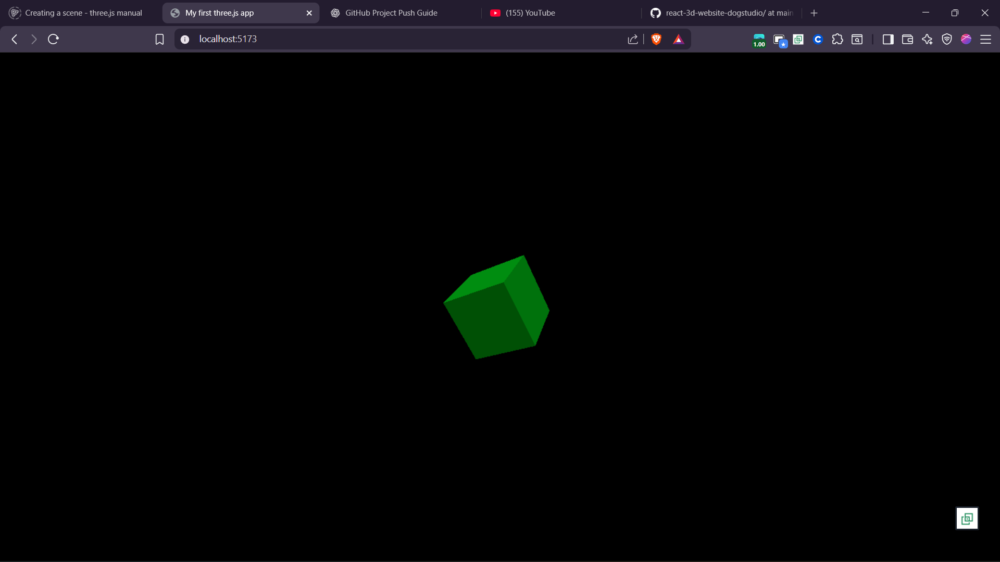

# 🚀 React 3D Website – DogStudio Clone  
A modern 3D interactive website built using **React**, **Three.js**, and **GSAP**, inspired by DogStudio’s creative web experience.

This project is part of my learning journey to explore advanced front-end animations, 3D scenes, and UI interactions.

---

## 🌟 Features
- 🧊 Fully interactive **3D models** built with Three.js  
- ⚡ Smooth GSAP animations for transitions & interactions  
- 🔄 React component-based architecture  
- 🎨 Creative modern UI inspired by DogStudio  
- 🌓 Supports responsive design for all screen sizes  
- 🔥 Optimized WebGL rendering  

---

## 🛠️ Tech Stack
| Technology | Usage |
|-----------|--------|
| **React.js** | UI Components & structure |
| **Three.js** | 3D Scenes, Lighting, Camera, Meshes |
| **GSAP** | Animations & smooth transitions |
| **Vite** | Fast development environment |
| **Node.js** | Project dependencies |

---

## 📁 Rendered Demo Output 

